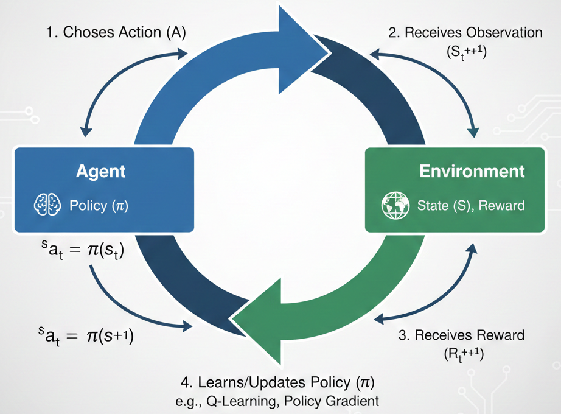

# Reinforcement Learning: From Theory to Practice

Welcome! This repository bridges the gap between Reinforcement Learning (RL) theory and code. We will explore fundamental concepts by implementing agents that learn to solve increasingly complex tasks.

## 1. Introduction to Reinforcement Learning

At its core, RL is about learning from **interaction**. An **Agent** takes actions in an **Environment**, which responds with a **State** update and a **Reward**.



- **Agent**: The learner (e.g., our code).
- **Environment**: The world (e.g., the game).
- **State ($s$)**: The current situation.
- **Action ($a$)**: The move the agent makes.
- **Reward ($r$)**: Feedback on how good the action was.

The goal is to find a **Policy ($\pi$)**—a strategy mapping states to actions—that maximizes the total expected reward over time.

### Quickstart
Install dependencies to get started:
```bash
pip install -r requirements.txt
```

---

## 2. Tabular Q-Learning (The Basics)

**The Challenge**: Cross a slippery `FrozenLake` without falling into holes.

### The Theory: Q-Values & The Bellman Equation
How does the agent know which action is best? It learns a **Action-Value Function**, $Q(s, a)$, which estimates the total future reward of taking action $a$ in state $s$.

For simple environments like FrozenLake, we can store these values in a table (a Q-Table). The agent updates this table based on its experience using the **Bellman Equation**:

$$ Q(s, a) \leftarrow Q(s, a) + \alpha [r + \gamma \max_{a'} Q(s', a') - Q(s, a)] $$

- $\alpha$ (Learning Rate): How much we trust new information.
- $\gamma$ (Discount Factor): How much we value future rewards vs. immediate ones.
- $\max_{a'} Q(s', a')$: The best possible future value from the next state.

### The Practice
Run the training script to watch the agent fill in its Q-Table. Initially, it explores randomly, but over time it learns the safe path.

```bash
python demos/FrozenLake/train.py
```

---

## 3. Deep Q-Networks (Going Deep)

**The Challenge**: Land a `LunarLander` spacecraft safely between two flags.

### The Theory: From Tables to Networks
In complex environments (like video games or robotics), the number of possible states is too huge for a table. We can't store a Q-value for every single pixel configuration!

Instead, we use a **Neural Network** to *approximate* the Q-function. This is called a **Deep Q-Network (DQN)**.
- Input: The state (e.g., coordinates, velocity).
- Output: Q-values for every possible action.

This introduces new challenges, like instability, which we solve with techniques like **Experience Replay** (learning from past memories) and **Target Networks** (keeping the learning target stable).

### The Practice
Train a Deep Q-Network to solve the Lunar Lander environment.

```bash
python demos/LunarLander/train.py
```
*(Note: Training a DQN takes longer than a simple table!)*

---

## 3. Soft Actor-Critic (Mastering Control)

**The Challenge**: Make a `Humanoid` walk without falling. This is a complex control task with many moving joints.

### The Theory: Actor-Critic Methods
For high-dimensional, continuous control tasks (like robotics), we need more stability than standard DQN. **Actor-Critic** methods use two networks:
- **Actor ($\pi$)**: Defines the policy (which action to take).
- **Critic ($Q$)**: Estimates the value of that action (how good it was).

We use **Soft Actor-Critic (SAC)**, which adds an "entropy" term to the reward. This encourages the agent to explore as many valid strategies as possible, making it robust and sample-efficient.

### The Practice
Train the humanoid walker using SAC.

```bash
python demos/Humanoid/train.py
```

---

## 4. Interactive Demos

Don't just watch—play! See if you can beat the agent.

**Play FrozenLake:**
```bash
python demos/FrozenLake/human_play.py
```

**Play Lunar Lander:**
```bash
python demos/LunarLander/human_play.py
```

**Watch Trained Agents:**
Once you've trained a model, watch it perform:
```bash
python demos/LunarLander/agent_play.py
# or
python demos/Humanoid/agent_play.py
```
