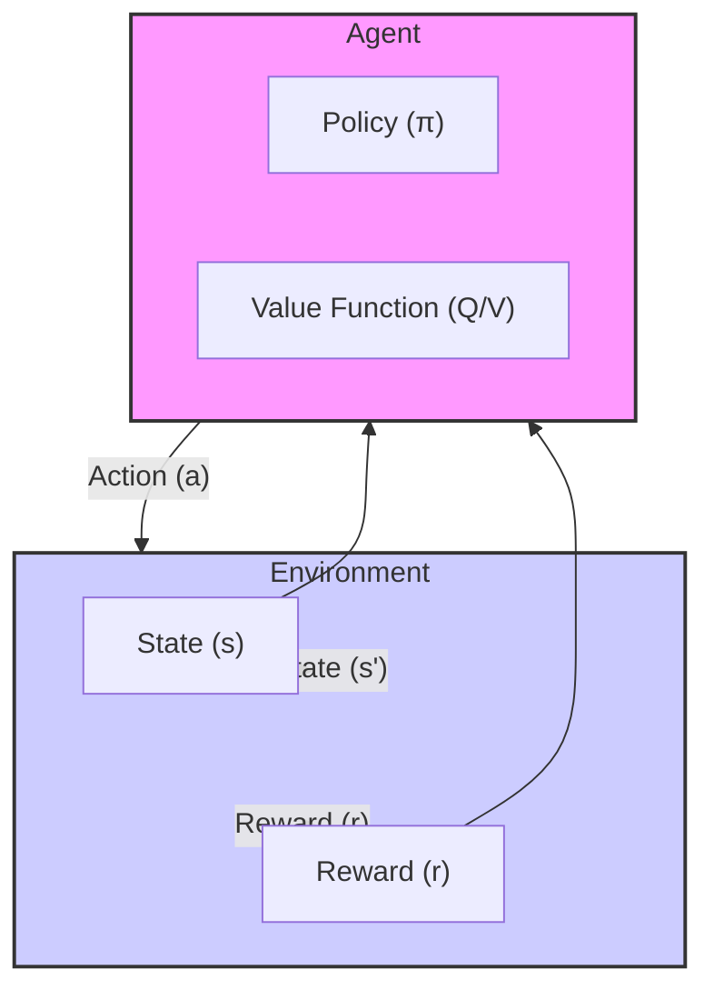

# Reinforcement Learning Demos


A personal portfolio project exploring fundamental Reinforcement Learning (RL) algorithms. This repository serves as a playground for implementing and understanding baselines, starting from tabular methods and progressing towards deep reinforcement learning.

## 🧠 Project Overview

The goal of this project is to build clear, reproducible implementations of RL algorithms from scratch. By applying these agents to classic control environments, I aim to demonstrate a solid grasp of:

- **Markov Decision Processes (MDPs)**
- **Value-based methods** (Q-Learning, SARSA)
- **Exploration vs. Exploitation strategies**
- **Hyperparameter tuning** in stochastic environments

## 🏗️ Architecture

The project follows a standard RL interaction loop:



## 🚀 Environments & Demos

### 🚖 Taxi-v3
**Task**: Navigate a taxi in a grid world to pick up a passenger at one location and drop them off at another.
- **State Space**: Discrete (500 states)
- **Action Space**: Discrete (6 actions)
- **Challenge**: Sparse rewards and requiring a specific sequence of actions.

**Run Demo:**
```bash
python demos/Taxi/play.py
```

**Training:**
```bash
python demos/Taxi/q_learning.py
```

> [!NOTE]
> **Key Takeaway**: Taxi is a deterministic environment (mostly), making it an excellent testbed for verifying Q-table convergence. The agent quickly learns the optimal path.

---

### ❄️ FrozenLake-v1
**Task**: Cross a frozen lake from Start (S) to Goal (G) without falling into Holes (H).
- **State Space**: Discrete (16 states for 4x4 map)
- **Action Space**: Discrete (4 actions)
- **Challenge**: Stochastic transitions (`is_slippery=True`). Moving "Right" might result in moving "Down" or "Up".

**Run Demo:**
```bash
python demos/FrozenLake/play.py
```

**Training:**
```bash
python demos/FrozenLake/q_learning.py
```

> [!NOTE]
> **Key Takeaway**: In stochastic environments, the agent must learn a safe policy rather than just a direct path. High exploration (epsilon) is crucial early on to discover the goal despite the slippery ice.

## 🛠️ Installation

1. **Clone the repository**
   ```bash
   git clone https://github.com/yourusername/reinforcement-learning-demos.git
   cd reinforcement-learning-demos
   ```

2. **Create and activate a virtual environment (optional but recommended)**
   ```bash
   python -m venv venv
   source venv/bin/activate  # On Windows: venv\Scripts\activate
   ```

3. **Install dependencies**
   ```bash
   pip install -r requirements.txt
   ```

4. **Install the local package**
   ```bash
   pip install -e .
   ```

## 📂 Repository Structure

```
reinforcement-learning-demos/
├── demos/                  # Runnable scripts for each environment
│   ├── Taxi/
│   └── FrozenLake/
├── rl_agents/              # Core agent implementations
│   ├── tabular_q_learning.py
│   ├── dqn.py              # (WIP) Deep Q-Network
│   └── agent.py            # Base classes
├── assets/                 # Images and diagrams
├── requirements.txt
└── README.md
```

## 📚 Theory: Tabular Q-Learning

We use the **Bellman Optimality Equation** to update our Q-values:

$$Q(s, a) \leftarrow Q(s, a) + \alpha [r + \gamma \max_{a'} Q(s', a') - Q(s, a)]$$

Where:
- $\alpha$: Learning rate
- $\gamma$: Discount factor
- $r$: Immediate reward

The agent uses an **$\epsilon$-greedy policy** for exploration, taking a random action with probability $\epsilon$ and the best known action with probability $1-\epsilon$.

## 🔮 Roadmap

- [x] Tabular Q-Learning (Taxi, FrozenLake)
- [ ] Deep Q-Network (DQN) for LunarLander-v2
- [ ] Policy Gradient (REINFORCE)
- [ ] Actor-Critic methods
- [ ] Experiment tracking with TensorBoard/WandB

## 📄 References

- [Sutton & Barto, Reinforcement Learning: An Introduction](http://incompleteideas.net/book/the-book-2nd.html)
- [Gymnasium Documentation](https://gymnasium.farama.org/)
