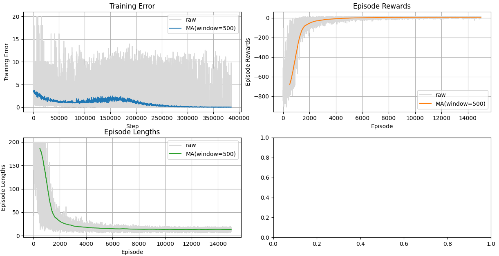
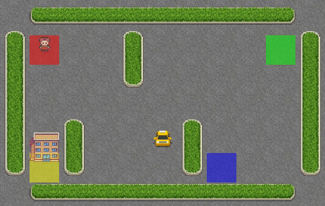
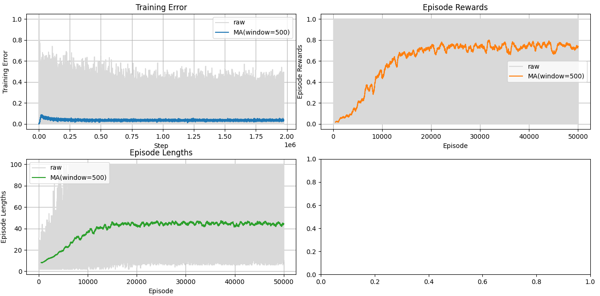
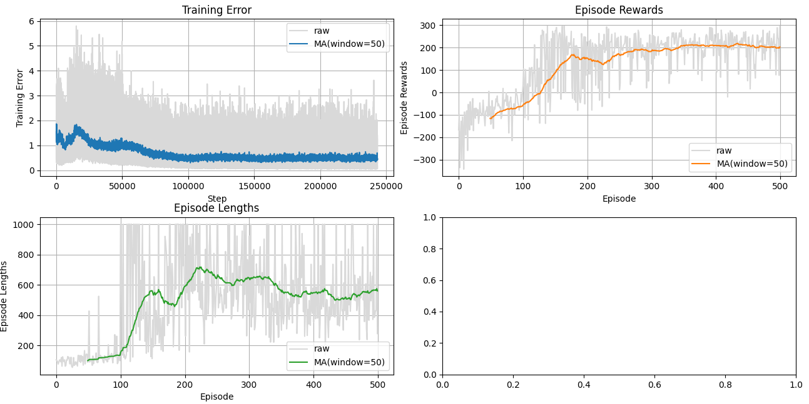
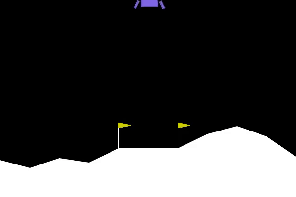
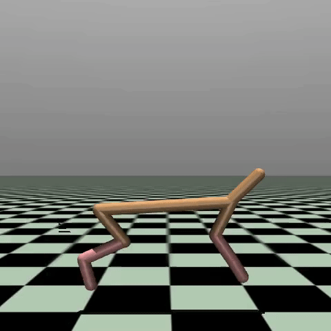
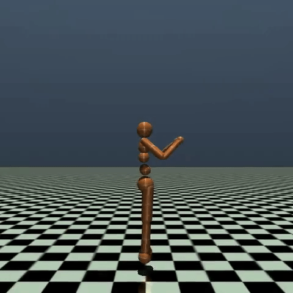

# Reinforcement Learning: From Theory to Practice

Welcome! This repository bridges the gap between Reinforcement Learning (RL) theory and implementation. We will explore fundamental concepts by implementing agents that learn to solve increasingly complex tasks.

## Getting Started

1. **Clone the repository**:
   ```bash
   git clone https://github.com/mfabregat/reinforcement-learning-demos.git
   cd reinforcement-learning-demos
   ```
2. **Install dependencies**:
   ```bash
   pip install -r requirements.txt
   ```

---

## 1. Introduction to Reinforcement Learning

At its core, RL is about learning from **interaction**. An **Agent** takes actions in an **Environment**, which responds with a **State** update and a **Reward**.


- **Agent**: The decision-making entity (e.g., our code).
- **Environment**: The context in which the agent operates (e.g., the game).
- **State ($s$)**: The current situation.
- **Action ($a$)**: The move the agent makes.
- **Reward ($r$)**: Feedback on how good the action was.

The goal is to find a **Policy ($\pi$)** (a strategy mapping states to actions) that maximizes the total expected reward over time.

---

## 2. Tabular Q-Learning (The Basics)

### The Theory: Q-Values & The Bellman Equation
How does an agent determine the optimal action? It learns an **Action-Value Function**, $Q(s, a)$, which estimates the total future reward of taking action $a$ in state $s$.

For low-dimensional environments, we can store these values efficiently in a lookup table (a Q-Table). The agent updates this table based on its experience using the **Bellman Equation**:

$$ Q(s, a) \leftarrow Q(s, a) + \alpha [r + \gamma \max_{a'} Q(s', a') - Q(s, a)] $$

- $\alpha$ (Learning Rate): How much we trust new information.
- $\gamma$ (Discount Factor): How much we value future rewards vs. immediate ones.
- $\max_{a'} Q(s', a')$: The best possible future value from the next state.

### The Challenge: Exploration vs. Exploitation
A key challenge in RL is balancing:
- **Exploration**: Trying new actions to discover better strategies.
- **Exploitation**: Using the current best known strategy to maximize reward.

Common strategies include $\epsilon$-greedy, where the agent explores with probability $\epsilon$ and exploits with probability $1 - \epsilon$.

### The Practice: Learning to Drive a Taxi
The first environment is `Taxi-v3`. The agent must pick up and drop off passengers at the right locations on a grid.

> **_Note:_** When we refer to _environments_ like Taxi, we are referring to those provided by the [Gymnasium library](https://gymnasium.farama.org/). This library is the standard for prototyping RL environments and algorithms in Python.

First, try controlling the taxi yourself to understand the constraints:

```bash
python demos/Taxi/human_play.py
```

Now, let's train a Q-Learning agent to master the Taxi environment:

```bash
python demos/Taxi/train.py
```

The script generates figures illustrating the agent's learning progress:



Finally, we can watch the trained agent in action:

```bash
python demos/Taxi/agent_play.py
```


Note that this environment is _deterministic_; the same action in the same state will always yield the same result. This makes it easier for the agent to learn.

### The Practice: Navigating FrozenLake
Building on our Q-learning foundation, we next challenge the agent with `FrozenLake-v1`, where it must navigate a slippery frozen lake to reach a goal.
Every time an action is taken, there's a chance the agent will slip and end up in a different state than intended. This stochasticity makes learning more challenging.

Once again, you can try playing it yourself:

```bash
python demos/FrozenLake/human_play.py
```

Now, let's train a Q-Learning agent for FrozenLake:

```bash
python demos/FrozenLake/train.py
```



Note how the learning curve is less smooth than in Taxi, due to the environment's randomness.

Finally, watch the trained agent navigate the frozen lake:

```bash
python demos/FrozenLake/agent_play.py
```


> **Key Takeaway:** Tabular Q-Learning is intuitive and mathematically grounded, making it the perfect starting point. However, it requires storing a value for every possible state, which becomes impossible in complex, high-dimensional environments.

---

## 3. Deep Q-Networks (Going Deep)

### The Theory: From Tables to Networks
What happens when the state space becomes too large for a table?
Moreover, environments are not always discrete; they can have continuous state spaces (like positions and velocities). Discretizing them often leads to loss of information and poor performance.
In complex environments (like video games or robotics), the number of possible states is intractably large for a table. We cannot store a Q-value for every single pixel configuration!

Instead, we use a **Neural Network** to *approximate* the Q-function. This is called a **Deep Q-Network (DQN)**.
- Input: The state (e.g., coordinates, velocity).
- Output: Q-values for every possible action (i.e., how good each action is for the input state).

This introduces new challenges, like instability, which we solve with techniques like **Experience Replay** (learning from past memories) and **Target Networks** (keeping the learning target stable).

### The Practice: Learning to Land a Spacecraft on the Moon
The `LunarLander-v2` is a classic control problem where the agent must land a spacecraft safely on the moon's surface. You can try it out yourself:
```bash
python demos/LunarLander/human_play.py
```

Now, let's train a DQN agent to master the Lunar Lander:

```bash
python demos/LunarLander/train.py
```



Finally, watch the trained agent land the spacecraft:

```bash
python demos/LunarLander/agent_play.py
```


> **Key Takeaway:** DQN solves the "curse of dimensionality" by using Neural Networks to approximate Q-values. This allows us to handle complex state spaces (like images), but it is still limited to discrete actions (e.g., "Left", "Right", "Fire").

---

## 4. Policy Gradients (Directly Learning Policies)

### Limitations of Value-Based Methods
Value-based methods like DQN face challenges in:
- **Continuous Action Spaces**: Finding $\max_a Q(s,a)$ becomes a complex optimization problem when actions are continuous.
- **Stochastic Policies**: They inherently learn deterministic policies (always picking the max), which allows less flexibility in uncertain environments.

### The Theory: Policy Optimization
**Policy Gradient** methods directly optimize the policy $\pi(a|s)$ instead of estimating value functions. This is especially useful for environments with continuous action spaces (like robots) where selecting discrete actions isn't feasible.
The key idea is to adjust the policy parameters $\theta$ in the direction that maximizes expected reward. The update rule is based on the **Policy Gradient Theorem**:
$$ \nabla_\theta J(\theta) = \mathbb{E}_{s \sim d^\pi, a \sim \pi_\theta} [\nabla_\theta \log \pi_\theta(a|s) Q^\pi(s, a)] $$

Where:
- $J(\theta)$: The expected return under policy $\pi_\theta$.
- $d^\pi$: The state distribution under policy $\pi$.

There exist several algorithms based on this idea, but one of the most popular is **Proximal Policy Optimization (PPO)**, which balances exploration and exploitation while ensuring stable updates.

### The Practice: Learning to Run
We now advance to continuous control environments. The `HalfCheetah-v4` environment requires the agent to learn to run as fast as possible using a simulated two-legged robot.

This time, the action space is continuous (e.g., how much to move each joint) and 6-dimensional, so there's no easy way to test it manually.
Instead, let's directly train a PPO agent to master the HalfCheetah:

```bash
python demos/HalfCheetah/train.py
```

This time, rather than coding our own PPO implementation, which would be less efficient, we leverage the powerful [Stable Baselines3](https://stable-baselines3.readthedocs.io/en/master/) library.
However, the REINFORCE algorithm has been implemented from scratch in `rl_agents/reinforce.py` for educational purposes.

Let's see how well our agent learned to run:

```bash
python demos/HalfCheetah/agent_play.py
```


> **Key Takeaway:** Policy Gradient methods (like PPO) directly learn the optimal policy, allowing for continuous control (e.g., robot joints) and stochastic behaviors. However, they can be sample-inefficient and sometimes unstable compared to value-based methods.

---


## 5. Actor-Critic methods (Mastering Control)
### The Theory: Combining Value and Policy Learning
**Actor-Critic** methods combine the strengths of value-based and policy-based approaches.
They maintain two models:
- The **Actor** learns the policy $\pi(a|s)$, deciding which action to take (like in policy gradients).
- The **Critic** estimates the value function $V(s)$ or $Q(s, a)$, providing feedback (thus _critic_) on how good the action was (like in value-based methods).
The Actor updates its policy based on the feedback from the Critic, allowing for more stable and efficient learning.

In this tutorial, we will use the **Soft Actor-Critic (SAC)** algorithm implemented in Stable Baselines3, which is particularly effective for continuous action spaces.

### The Practice: Learning to Walk with a Humanoid Robot
The `Humanoid-v5` environment challenges the agent to control a humanoid robot to stand and walk upright.
Let's train a SAC agent to master the Humanoid:

```bash
python demos/Humanoid/train.py
```
This environment is quite complex, so training will take a significant amount of time (several hours).

Once trained, we can watch the humanoid agent in action:

```bash
python demos/Humanoid/agent_play.py
```


Indeed, the gait learned by the humanoid is quite strange, but it manages to stay upright and walk forward! The training could be further improved by tuning hyperparameters and training for longer, but this serves as a solid introduction to Actor-Critic methods.
You can check [Repository] for a realistic humanoid simulation and a robust walking policy.

> **Key Takeaway:** Actor-Critic methods (like SAC) combine the best of both worlds: the stable learning of value-based methods and the continuous control capabilities of policy-based methods. They represent the state-of-the-art for many control tasks.

---

## 6. Further Reading
To dive deeper into RL, we recommend:
- **[Reinforcement Learning: An Introduction](http://incompleteideas.net/book/the-book-2nd.html)** by Sutton & Barto (The Bible of RL).
- **[Spinning Up in Deep RL](https://spinningup.openai.com/)** by OpenAI (Excellent code-first introduction).
- Hugging Face's **[Deep RL Course](https://huggingface.co/learn/deep-rl-course/unit0/introduction)** and **[Robot Learning: A Tutorial](https://huggingface.co/spaces/lerobot/robot-learning-tutorial)**.